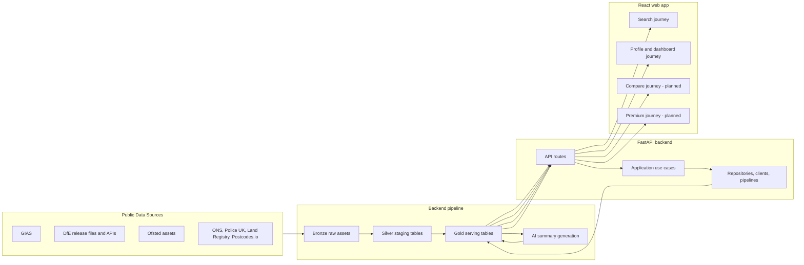

# Civitas - System Overview

## Document Control

- Status: Current planning baseline
- Last updated: 2026-03-06
- Related documents:
  - `project-brief.md`
  - `data-architecture.md`
  - `phased-delivery.md`
  - `deployment-strategy.md`

## What We Are Building

Civitas is a UK public-data research platform that consolidates fragmented government datasets into a fast, decision-grade web experience.

The current product surface is centered on school research:

- postcode-first search
- school profile pages
- multi-year trends
- benchmarked dashboard views
- area context
- one stored AI-generated factual school overview

The next planned product slices are school comparison and premium access control.

## Current Product State

Implemented today:

1. Search by postcode with linked list and map results.
2. School profile pages with demographics, attendance, behaviour, workforce, performance, Ofsted, deprivation, crime, house-price context, and benchmarked trends.
3. Bronze -> Silver -> Gold pipelines for the active source set with quality, completeness, and observability controls.
4. Pre-generated AI school overview summaries with provenance and validation.

Still planned:

1. Compare up to four schools side by side.
2. Authentication, entitlements, and payment-backed premium access.
3. Post-MVP growth slices such as SEO pages, operational admin surfaces, report export, and deeper optimization work.

## Architecture Shape

## Technology Choices

| Component | Choice | Rationale |
|---|---|---|
| Backend runtime | Python 3.11+ and FastAPI | Fits the pipeline-heavy backend and keeps API contracts explicit |
| Backend architecture | Hexagonal layering | Maintains strict inward dependencies and testability |
| Serving database | PostgreSQL + PostGIS | Spatial search, relational joins, and straightforward historical fact storage |
| Pipeline model | Bronze -> Silver -> Gold | Traceable, repeatable, and aligned with current runbooks |
| Frontend | React + Vite + TypeScript | Typed, fast iteration, and contract-driven integration |
| API contract | Backend-generated OpenAPI | Single source of truth for frontend wire types |
| Package management | `uv` and `npm` | Deterministic tooling across the monorepo |

## Current Backend Surface

Primary backend feature areas:

- `schools`: search and identity
- `school_profiles`: profile assembly for latest data
- `school_trends`: multi-year series and dashboard responses
- `school_summaries`: stored AI overview generation and retrieval
- `operations`: pipeline health, data quality, and operational concerns

## Current Frontend Surface

Primary frontend feature areas:

- `schools-search`: postcode search, result cards, map, and search states
- `school-profile`: profile header, domain cards, trend/dashboard presentation, and AI overview rendering

Compare and premium flows are not yet implemented, so they remain planning-only phases.

## Architectural Decisions That Still Matter

1. Backend OpenAPI remains the contract boundary; the frontend does not reach into backend internals.
2. Bronze assets remain the reproducibility checkpoint.
3. Silver normalization is where source contracts and rejection handling are enforced.
4. Gold tables are shaped for API access patterns rather than generic raw analysis.
5. AI summary generation is asynchronous and post-pipeline, not request-time.

## What This Document Does Not Cover

- Detailed source inventory and cadences: `data-sources.md`
- Gold tables and pipeline behavior: `data-architecture.md`
- Phase-by-phase sequencing: `phased-delivery.md`
- Hosting and runtime topology: `deployment-strategy.md`
