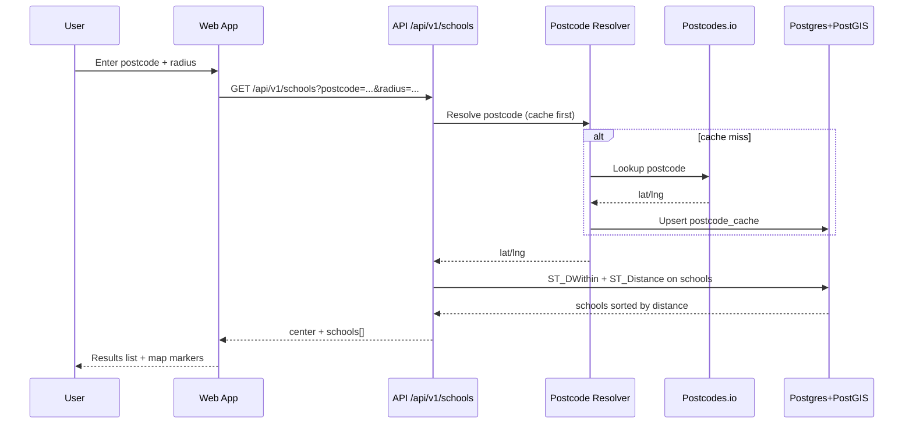

# Phase 0C Design - Postcode Search API

## Document Control

- Status: Implemented
- Last updated: 2026-02-27
- Depends on:
  - `.planning/phases/phase-0/0B-gias-pipeline.md`
  - `.planning/data-architecture.md`
  - `docs/architecture/boundaries.md`

## Objective

Expose schools near a user postcode through a stable backend contract using Postcodes.io resolution plus PostGIS radius queries.

## Request Sequence



## Scope

### In scope

- Postcodes.io client integration and postcode normalization.
- `postcode_cache` persistence with TTL policy.
- Application use case + ports for postcode resolution and school search.
- API route and schema for search response payload.

### Out of scope

- Frontend rendering and UX (0D).
- Premium gating behavior (Phase 4).
- Additional filters beyond radius sorting (future phases).

## Decisions

1. **Endpoint**: `GET /api/v1/schools` with `postcode` and optional `radius` miles.
2. **Default radius**: 5 miles.
3. **Max radius (Phase 0 guardrail)**: 25 miles to control query cost.
4. **Postcode cache is mandatory**: cache-first resolution path is required for reliability and cost control.
5. **Cache TTL**: 30 days for successful postcode resolutions.
6. **Distance semantics**: sort by straight-line distance from resolved postcode coordinates.

## Implementation Progress (2026-02-28)

- Completed: added schools domain/application models, ports, and `SearchSchoolsByPostcodeUseCase`.
- Completed: added Postcodes.io client adapter with retry/backoff and explicit not-found/unavailable error mapping.
- Completed: added cache-first postcode resolver (`postcode_cache` with 30-day TTL semantics).
- Completed: added PostGIS school radius repository with deterministic ordering (`distance ASC`, `urn ASC`) and open-school filtering.
- Completed: added `GET /api/v1/schools` route + API schemas and bootstrap dependency wiring.
- Completed: added Alembic migration for `postcode_cache`.
- Completed: added unit/integration coverage for use case, cache repository, API contract/error paths, and spatial repository (DB-availability gated).

## External Resolver Contract

- Primary endpoint: `GET https://api.postcodes.io/postcodes/{postcode}`
- Compatible alias endpoint: `GET https://postcodes.io/postcodes/{postcode}`
- Required response fields from `result`:
  - `postcode`
  - `latitude`
  - `longitude`
  - `lsoa`
  - `admin_district`
- Optional fields retained for future enrichment:
  - `msoa`
  - `country`
  - `region`
  - `codes.lsoa`
  - `codes.msoa`

### Verification Snapshot

- Verified against live resolver on 2026-02-27 using postcode `SW1A2AA`.

## Contract

### Request

`GET /api/v1/schools?postcode={uk_postcode}&radius={miles}`

Query params:

- `postcode` (required)
- `radius` (optional float; default `5`; max `25`)

### Response

```json
{
  "query": {
    "postcode": "SW1A 1AA",
    "radius_miles": 5.0
  },
  "center": {
    "lat": 51.501009,
    "lng": -0.141588
  },
  "count": 2,
  "schools": [
    {
      "urn": "123456",
      "name": "Example Primary School",
      "type": "Community school",
      "phase": "Primary",
      "postcode": "SW1A 1AA",
      "lat": 51.5002,
      "lng": -0.1421,
      "distance_miles": 0.09
    }
  ]
}
```

### Errors

- `400`: invalid postcode or radius parameter.
- `404`: postcode not found by resolver.
- `503`: postcode resolver unavailable and no usable cache.

## Application And Infrastructure Design

### Ports (application layer)

- `SchoolSearchRepository`
  - `search_within_radius(center_lat, center_lng, radius_miles) -> list[SchoolSearchResult]`
- `PostcodeResolver`
  - `resolve(postcode) -> PostcodeCoordinates`

### Use case

- `SearchSchoolsByPostcodeUseCase`
  - normalize input postcode
  - resolve coordinates (cache first)
  - query schools within radius
  - return sorted response DTO

### Infrastructure adapters

- Postcodes.io client adapter.
- Postgres search repository using `ST_DWithin` + `ST_Distance`.
- Postcode cache repository backed by `postcode_cache`.

### SQL behavior

- query only open schools for Phase 0 list/map.
- compute distance in meters and convert to miles in response.
- apply deterministic ordering by `distance ASC`, then `urn ASC`.

## File-Oriented Implementation Plan

1. `apps/backend/src/civitas/domain/schools/` (new)
   - search result model/value objects if needed.
2. `apps/backend/src/civitas/application/schools/ports/`
   - `school_search_repository.py`
   - `postcode_resolver.py`
3. `apps/backend/src/civitas/application/schools/use_cases.py`
   - search-by-postcode use case.
4. `apps/backend/src/civitas/infrastructure/http/postcodes_io_client.py`
   - external postcode resolution adapter.
5. `apps/backend/src/civitas/infrastructure/persistence/postgres_school_search_repository.py`
   - spatial query implementation.
6. `apps/backend/src/civitas/infrastructure/persistence/postgres_postcode_cache_repository.py`
   - cache read/write + TTL checks.
7. `apps/backend/alembic/versions/*_phase0_postcode_cache.py`
   - create `postcode_cache` table + index.
8. `apps/backend/src/civitas/api/schemas/schools.py`
   - request/response DTOs.
9. `apps/backend/src/civitas/api/routes.py` (or a new `schools_routes.py`)
   - add `GET /api/v1/schools`.
10. `apps/backend/src/civitas/api/dependencies.py`
    - dependency providers for schools use case.
11. `apps/backend/src/civitas/bootstrap/container.py`
    - wire postgres repositories + postcode resolver.

## Testing And Quality Gates

### Backend tests to add

- `apps/backend/tests/unit/test_search_schools_use_case.py`
  - postcode normalization, parameter validation, ordering logic.
- `apps/backend/tests/unit/test_postcode_cache_repository.py`
  - TTL handling and cache hit/miss behavior.
- `apps/backend/tests/integration/test_schools_api.py`
  - contract tests for success + error paths.
- `apps/backend/tests/integration/test_school_search_repository.py`
  - spatial query correctness against seeded schools.

### Contract sync

After endpoint implementation:

1. `uv run --project apps/backend python tools/scripts/export_openapi.py`
2. regenerate web types from `apps/web/src/api/openapi.json`

### Required gates

- `make lint`
- `make test`

## Acceptance Criteria

1. API returns nearby schools sorted by distance for valid UK postcodes.
2. Invalid postcodes/radius values return deterministic error contracts.
3. Postcode resolution uses cache when present and refreshes stale entries.
4. OpenAPI schema reflects the schools search contract.

## Risks And Mitigations

- **Risk**: Postcodes.io transient failures reduce reliability.
  - **Mitigation**: cache-first resolution path and explicit 503 behavior.
- **Risk**: spatial query performance degradation at larger radii.
  - **Mitigation**: enforce max radius in Phase 0 and use GIST index.
