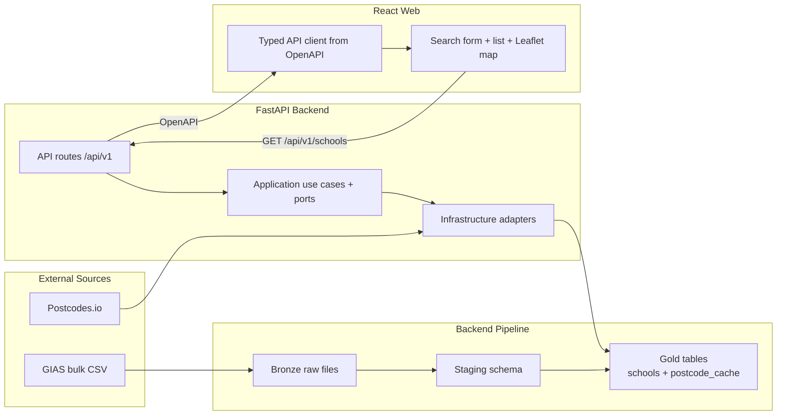

# Phase 0 Design Index - Data Foundation + GIAS Baseline

## Document Control

- Status: Draft
- Last updated: 2026-02-28
- Phase owner: Product + Engineering
- Source phase: `.planning/phased-delivery.md`

## Purpose

This folder contains the implementation-ready design for Phase 0. The objective is a complete vertical slice:

1. Run a real Bronze -> Staging -> Gold pipeline for GIAS.
2. Expose search-by-postcode schools data through API contracts.
3. Establish production-grade web foundations (theme tokens, primitives, quality rails).
4. Deliver a web list + map experience against that API.

## Architecture View

## Delivery Model

Phase 0 is split into six substantial deliverables. Each document is written for direct execution by agents.

1. `0A-data-platform-baseline.md`
2. `0E-configuration-foundation.md`
3. `0B-gias-pipeline.md`
4. `0C-postcode-search-api.md`
5. `0D1-web-foundations.md`
6. `0D-web-search-map.md`

## Execution Sequence

1. Complete 0A first.
2. Complete 0E as a configuration hardening gate.
3. Build 0B on the 0A platform and migration baseline.
4. Build 0C after 0B is queryable in Gold and 0E settings are wired.
5. Build 0D1 after 0C endpoint contract is stable.
6. Build 0D after 0D1 quality rails and primitives are in place.

## Progress (2026-02-28)

- 0A Data platform baseline: completed.
- 0E Configuration foundation: completed.
- 0B GIAS pipeline: completed.
- 0C Postcode search API: completed.
- 0D1 Web foundations: completed.
- 0D Web search + map: pending.

## Phase 0 Definition Of Done

- User enters a UK postcode and sees nearby schools in both list and map views.
- Search/map UI composes shared foundations (tokens + reusable primitives), not page-specific ad-hoc styling.
- `civitas pipeline run --source gias` is idempotent and re-runnable.
- Backend and web quality gates pass (`make lint`, `make test`).
- Import boundary tests remain green.

## Change Management

- `.planning/phased-delivery.md` remains the high-level source of truth.
- If any scope, sequence, or acceptance criteria evolve, update both this folder and `.planning/phased-delivery.md` in the same change.
- Keep decisions explicit in each doc under "Decisions".

## Decisions Captured

- 2026-02-27: Phase 0 is decomposed into 0A-0E rather than one large document.
- 2026-02-27: Phase 0 map implementation will use Leaflet for fastest delivery.
- 2026-02-27: Added 0E configuration foundation to centralize runtime settings before Phase 0 completion.
- 2026-02-28: Added 0D1 web foundations as a quality gate before 0D search/map delivery.
