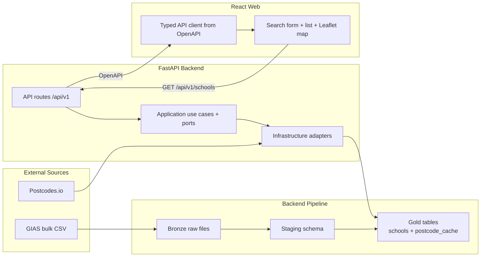

# Phase 0 Design Index - Data Foundation + GIAS Baseline

## Document Control

- Status: Draft
- Last updated: 2026-02-27
- Phase owner: Product + Engineering
- Source phase: `.planning/phased-delivery.md`

## Purpose

This folder contains the implementation-ready design for Phase 0. The objective is a complete vertical slice:

1. Run a real Bronze -> Staging -> Gold pipeline for GIAS.
2. Expose search-by-postcode schools data through API contracts.
3. Deliver a web list + map experience against that API.

## Architecture View

## Delivery Model

Phase 0 is split into four substantial deliverables. Each document is written for direct execution by agents.

1. `0A-data-platform-baseline.md`
2. `0B-gias-pipeline.md`
3. `0C-postcode-search-api.md`
4. `0D-web-search-map.md`

## Execution Sequence

1. Complete 0A first.
2. Build 0B on the 0A platform and migration baseline.
3. Build 0C after 0B is queryable in Gold.
4. Build 0D after 0C endpoint contract is stable.

## Phase 0 Definition Of Done

- User enters a UK postcode and sees nearby schools in both list and map views.
- `civitas pipeline run --source gias` is idempotent and re-runnable.
- Backend and web quality gates pass (`make lint`, `make test`).
- Import boundary tests remain green.

## Change Management

- `.planning/phased-delivery.md` remains the high-level source of truth.
- If any scope, sequence, or acceptance criteria evolve, update both this folder and `.planning/phased-delivery.md` in the same change.
- Keep decisions explicit in each doc under "Decisions".

## Decisions Captured

- 2026-02-27: Phase 0 is decomposed into 0A-0D rather than one large document.
- 2026-02-27: Phase 0 map implementation will use Leaflet for fastest delivery.
