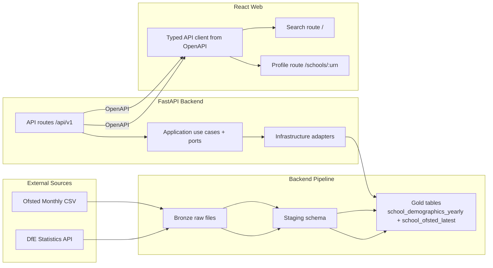

# Phase 1 Design Index - School Profiles + DfE Metrics + Ofsted Headline

## Document Control

- Status: In progress
- Last updated: 2026-03-02
- Phase owner: Product + Engineering
- Source phase: `.planning/phased-delivery.md`

## Purpose

This folder contains implementation-ready design for Phase 1. The objective is to extend the Phase 0 vertical slice from search and map into school profile depth, backed by callable external source contracts.

Phase 1 adds:

1. DfE-derived school demographics in Gold.
2. Latest Ofsted headline per school in Gold.
3. School profile and trends APIs.
4. Web routing and school profile page.

## Non-Negotiable Phase Gate

All source-dependent work is blocked by `1A-source-contract-gate.md`.

No pipeline implementation may proceed unless the source contract gate has passed with:

- real callable endpoints,
- verified response fields,
- explicit fallback path.

## Architecture View

## Delivery Model

Phase 1 is split into nine substantial deliverables:

1. `1A-source-contract-gate.md`
2. `1B-dfe-characteristics-pipeline.md`
3. `1C-ofsted-latest-pipeline.md`
4. `1D-school-profile-api.md`
5. `1E-school-trends-api.md`
6. `1F-web-routing-navigation-foundation.md`
7. `1F1-web-component-expansion-data-viz-baseline.md`
8. `1G-web-school-profile-page.md`
9. `1H-phase-1-quality-gates.md`

## Execution Sequence

1. Complete `1A` first. This is a hard gate.
2. Complete `1B` and `1C` once source contracts are verified.
3. Complete `1D` after `1B` and `1C` are queryable in Gold.
4. Complete `1E` after `1B` with trend-depth guardrails.
5. Complete `1F` after `1D` route contract is stable.
6. Complete `1F1` after `1F` (icon library available) and once `1D`/`1E` contracts clarify the data shapes components must present.
7. Complete `1G` after `1D`, `1E` OpenAPI contracts are frozen and `1F1` shared components are available.
8. Complete `1H` as final closeout and sign-off checklist.

## Source Verification Snapshot (2026-03-02)

- DfE statistics API endpoint family is callable:
  - `GET https://api.education.gov.uk/statistics/v1/publications?page=1&pageSize=20` -> `200`
  - `GET https://api.education.gov.uk/statistics/v1/publications/{publicationId}/data-sets?page=1&pageSize=20` -> `200`
  - `GET https://api.education.gov.uk/statistics/v1/data-sets/{dataSetId}/meta` -> `200`
  - `GET https://api.education.gov.uk/statistics/v1/data-sets/{dataSetId}/query?page=1&pageSize=1` -> `200`
  - `GET https://api.education.gov.uk/statistics/v1/data-sets/{dataSetId}/csv` -> `200`
- Verified school-level DfE dataset candidate:
  - dataset id: `019afee4-ba17-73cb-85e0-f88c101bb734`
  - CSV includes `school_urn` plus SEN/EHC/EAL/disadvantaged-related fields.
- Current verified DfE school-level coverage does not expose school-level ethnicity fields.
- Ofsted monthly latest endpoint family is callable:
  - landing page: `https://www.gov.uk/government/statistical-data-sets/monthly-management-information-ofsteds-school-inspections-outcomes` -> `200`
  - latest asset link on 2026-03-02:
    - `https://assets.publishing.service.gov.uk/media/698b20be95285e721cd7127d/Management_information_-_state-funded_schools_-_latest_inspections_as_at_31_Jan_2026.csv` -> `200`

## Progress (2026-03-02)

- 1A Source contract gate: completed.
- 1B DfE characteristics pipeline: completed.
- 1C Ofsted latest pipeline: completed.
- 1D School profile API: completed.
- 1E School trends API: completed.
- 1F Web routing & navigation foundation: completed.
- 1F1 Web component expansion & data viz baseline: completed.
- 1G-1H: pending.

## Tracking Log

- 2026-03-02 (implementation verification checkpoint):
  - Revalidated Phase 1D backend tests:
    - `uv run --project apps/backend pytest apps/backend/tests/unit/test_get_school_profile_use_case.py -q`
    - `uv run --project apps/backend pytest apps/backend/tests/integration/test_school_profile_api.py -q`
    - `uv run --project apps/backend pytest apps/backend/tests/integration/test_school_profile_repository.py -q`
  - Synced backend OpenAPI contract:
    - `uv run --project apps/backend python tools/scripts/export_openapi.py`
  - Revalidated repository gates:
    - `make lint`
    - `make test`
  - Result: all commands passed; no additional code changes required for 1D baseline stability.
- 2026-03-02 (implementation verification checkpoint):
  - Completed Phase 1E trends implementation and backend wiring:
    - domain/application/infrastructure/api modules under `school_trends`.
  - Revalidated Phase 1E tests:
    - `uv run --project apps/backend pytest apps/backend/tests/unit/test_get_school_trends_use_case.py -q`
    - `uv run --project apps/backend pytest apps/backend/tests/integration/test_school_trends_api.py -q`
    - `uv run --project apps/backend pytest apps/backend/tests/integration/test_school_trends_repository.py -q`
  - Synced contracts:
    - `uv run --project apps/backend python tools/scripts/export_openapi.py`
    - `cd apps/web && npm run generate:types`
  - Revalidated repository gates:
    - `make lint`
    - `make test`
  - Result: all commands passed; Phase 1E is complete and tracked.
- 2026-03-02 (implementation verification checkpoint):
  - Completed Phase 1F Web routing & navigation foundation (prior session).
- 2026-03-02 (implementation verification checkpoint):
  - Completed Phase 1F1 Web component expansion & data viz baseline:
    - Installed `recharts`, `@radix-ui/react-tabs`, `@radix-ui/react-tooltip`, `@radix-ui/react-toast`.
    - UI primitives: Badge (6 CVA variants), Tabs (Radix compound), Tooltip, Toast (imperative dispatch via context).
    - Data components: StatCard, TrendIndicator, RatingBadge, Sparkline (hand-rolled SVG), MetricGrid, MetricUnavailable.
    - Chart theme: `src/shared/charts/chart-theme.ts` mapping Recharts to Civitas tokens.
    - Tests: 56 new tests (19 UI expansion + 37 data components) — all passing.
  - Quality gates verified:
    - `npm run lint` — clean
    - `npm run typecheck` — clean
    - `npm run test` — 102 tests passing (11 files)
    - `npm run build` — production build succeeds
    - `npm run budget:check` — app shell JS 116.2 KiB (budget 170), CSS 12.6 KiB (budget 35), map chunk 45.2 KiB (budget 260)
    - `make lint` — clean
    - `make test` — 80 backend + 102 frontend tests passing
  - Result: all gates passed; Phase 1F1 is complete.

## Phase 1 Definition Of Done

- User can open `/schools/{urn}` from search results and view:
  - latest demographics snapshot from Gold,
  - latest Ofsted headline with inspection/publication date,
  - trend data where historical depth exists.
- Source contract gate is documented as passed in Phase 1 artefacts.
- OpenAPI contract is updated and consumed by web generated types.
- Web routing supports search route and profile route with stable navigation.
- `make lint` and `make test` pass.

## Change Management

- `.planning/phased-delivery.md` remains the high-level source of truth.
- If scope, sequencing, or acceptance criteria evolve, update this folder and `.planning/phased-delivery.md` in the same change.
- If source coverage constraints force metric changes, record the decision explicitly in `1A` and the affected deliverable docs.

## Decisions Captured

- 2026-03-02: Phase 1 includes a non-negotiable source contract gate before any source-dependent implementation.
- 2026-03-02: DfE Phase 1 planning is based on callable `api.education.gov.uk/statistics/v1` endpoints, with explicit coverage flags for unsupported school-level fields.
- 2026-03-02: Trends API must degrade gracefully when fewer than 3 years are available from validated sources.
