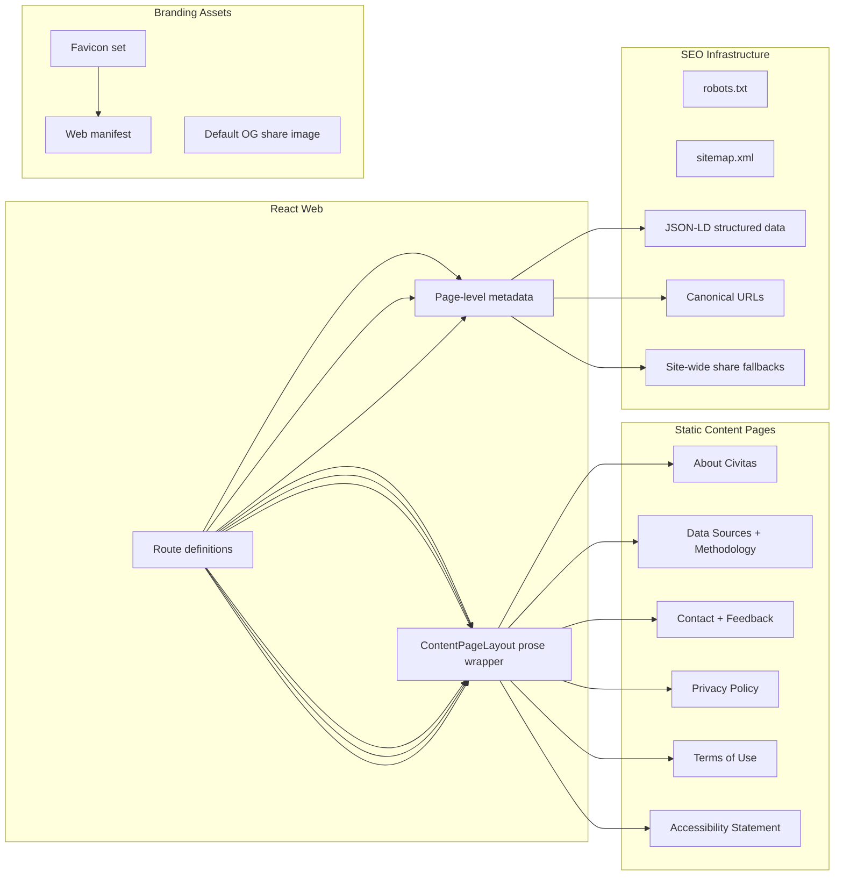

# Phase 13 Design Index - Product Foundation And Launch Readiness

## Document Control

- Status: Planned
- Last updated: 2026-03-09
- Phase owner: Product + Engineering
- Source phase: `.planning/phased-delivery.md`
- Legacy workstream IDs: `L1` through `L5`

## Purpose

This folder contains implementation-ready planning for the foundational product pages, baseline SEO infrastructure, legal disclosures, and branding assets that must exist before Civitas is publicly launched or begins collecting user data.

Phases 0 through 9 delivered the core research product. Phase 10 introduces authenticated identity and billing. This phase fills the gap between a functional product and a publicly launchable one.

## Why This Phase Exists

As of 2026-03-09:

- The footer links for About, Contact, and Privacy point to `#` and no static pages exist.
- `index.html` has no meta description, favicon, web manifest, or site-wide share metadata.
- No `robots.txt` exists.
- No privacy policy or terms of use exist, both of which must be live before Phase 10 billing can ship to real users.
- No published cookie disclosure exists for planned authenticated sessions, and no future-ready preferences flow is defined for any non-essential cookies that may be added later.
- No structured data or sitemap infrastructure exists for crawler entry points.
- School profile pages have no page-level title, description, canonical URL, or structured data.

## Relationship To Other Phases

### Phase 10 Prerequisite

`L4-legal-and-compliance.md` is a **hard prerequisite** for Phase 10 Stage 10B (billing and webhooks). Privacy Policy and Terms of Use must be live before collecting payment data in production.

Privacy and cookie disclosures must be live before Phase 10 Stage 10A enables production sign-in. A consent/preferences banner becomes mandatory only if Civitas introduces non-essential cookies such as analytics, advertising, or experimentation cookies.

### Phase 12 Coordination

Phase 12 includes `11A-seo-location-pages.md` for location-based SEO pages. The SEO infrastructure delivered in `L2` (route metadata, static sitemap, and structured data) is the baseline that later discoverability work builds on.

### Can Run In Parallel

This phase has no backend pipeline dependencies and no API contract changes. It can run alongside Phase 10 Stage 10A identity work, but the legal copy and sign-in disclosures must merge before production auth rollout, and the legal deliverables must merge before Stage 10B goes live.

## Architecture View

## Delivery Model

Phase 13 is split into five deliverables:

1. `L1-content-page-foundation.md`
2. `L2-seo-and-discoverability-infrastructure.md`
3. `L3-about-and-data-sources.md`
4. `L4-legal-and-compliance.md`
5. `L5-quality-gates.md`

## Execution Sequence

1. Complete `L1` first so the shared content page layout and route metadata infrastructure exist.
2. Complete `L2` alongside or immediately after `L1` so static assets, route metadata, and structured data are available before content pages ship.
3. Complete `L3` after `L1` so About, Data Sources, and Contact can use the shared content layout.
4. Complete `L4` after `L1` so Privacy, Terms, Accessibility, and sign-in disclosures can use the shared content layout. **Must complete before Phase 10 Stage 10B.**
5. Complete `L5` as final closeout and sign-off.

## Definition Of Done

- All footer placeholder links (`#`) resolve to real routed pages.
- Launch-managed routes have meaningful browser-visible `<title>` and `<meta name="description">` values.
- School profile pages include canonical URLs and JSON-LD `School` structured data.
- `robots.txt` and a static-route `sitemap.xml` are served for crawler entry points.
- Favicon and web manifest render correctly across browsers and mobile home-screen add.
- Generic site-wide sharing metadata and a default OG image are present in `index.html`.
- Privacy Policy and Terms of Use are published and linked from footer and sign-in flows.
- Cookie disclosures are published; a consent/preferences banner is required only before any non-essential cookies are introduced.
- Accessibility statement is published.
- `make lint`, `make test`, and `cd apps/web && npm run build` pass.
- No new horizontal overflow or layout regression at 375px.

## Change Management

- If content page layout conventions established here conflict with Phase 12 SEO location pages, update both `L1` and `11A-seo-location-pages.md` in the same change.
- If school-profile share cards or school-profile sitemap generation move into scope, add a dedicated rendering/discoverability follow-on slice in the same change set rather than silently expanding `L2`.

## Decisions Captured

- 2026-03-09: Phase 13 created to address missing product foundation work that was not covered by any existing phase.
- 2026-03-09: Legal deliverables designated as a hard prerequisite for Phase 10 Stage 10B, with privacy/cookie disclosures required before any production sign-in rollout.
- 2026-03-09: Baseline deliverables remain frontend-only or static assets; reliable school-profile share cards and school-profile sitemap generation are deferred until a rendering/discoverability follow-on slice is approved.
- 2026-03-09: Existing Civitas component system (Radix + Tailwind + CVA) is used; no new component library adoption.
