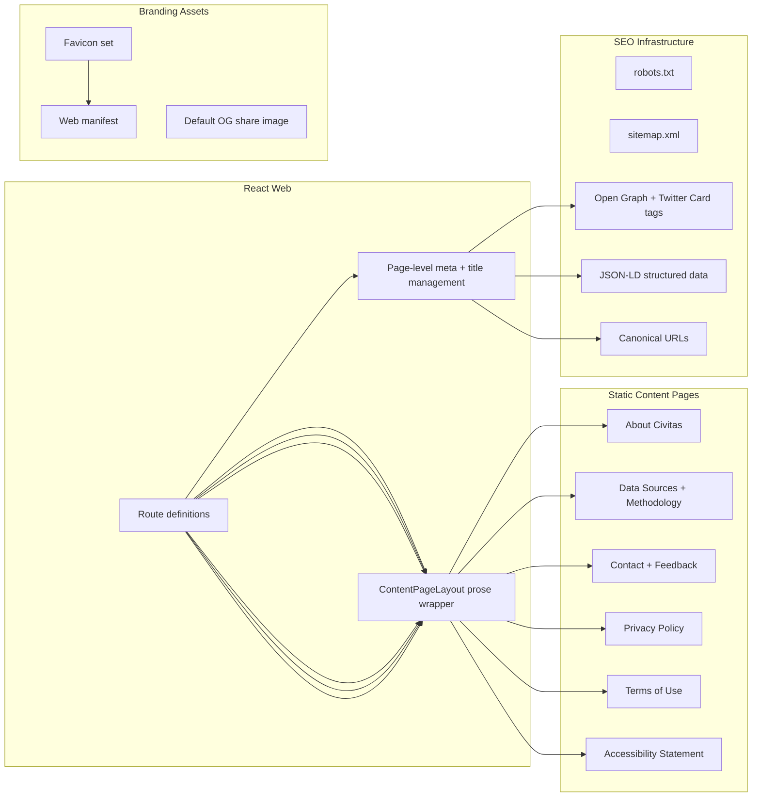

# Phase 13 Design Index - Product Foundation And Launch Readiness

## Document Control

- Status: Planned
- Last updated: 2026-03-09
- Phase owner: Product + Engineering
- Source phase: `.planning/phased-delivery.md`
- Legacy workstream IDs: `L1` through `L5`

## Purpose

This folder contains implementation-ready planning for the foundational product pages, SEO infrastructure, legal compliance, and branding assets that must exist before Civitas is publicly launched or begins collecting user data.

Phases 0 through 9 delivered the core research product. Phase 10 introduces authenticated identity and billing. This phase fills the gap between a functional product and a publicly launchable one.

## Why This Phase Exists

As of 2026-03-09:

- The footer links for About, Contact, and Privacy point to `#` — no static pages exist.
- `index.html` has no meta description, Open Graph tags, favicon, or web manifest.
- No `robots.txt` exists.
- No privacy policy or terms of use exist — both are legally required before Phase 10 authentication and billing can ship to real users.
- No cookie consent mechanism exists — required in the UK before setting session cookies.
- No structured data or sitemap infrastructure exists for search engine discoverability.
- School profile pages have no page-level title or social sharing metadata.

## Relationship To Other Phases

### Phase 10 Prerequisite

`L4-legal-and-compliance.md` is a **hard prerequisite** for Phase 10 Stage 10B (billing and webhooks). Privacy Policy and Terms of Use must be live before collecting payment data or operating authenticated sessions in production.

Cookie consent must be live before Phase 10 Stage 10A sets session cookies in any non-local environment.

### Phase 12 Coordination

Phase 12 includes `11A-seo-location-pages.md` for location-based SEO pages. The SEO infrastructure delivered in `L2` (meta management, sitemap, structured data) is the foundation that Phase 12 SEO work builds on.

### Can Run In Parallel

This phase has no backend pipeline dependencies and no API contract changes. It can run alongside Phase 10 Stage 10A identity work, but the legal deliverables must merge before Stage 10B goes live.

## Architecture View

## Delivery Model

Phase 13 is split into five deliverables:

1. `L1-content-page-foundation.md`
2. `L2-seo-and-discoverability-infrastructure.md`
3. `L3-about-and-data-sources.md`
4. `L4-legal-and-compliance.md`
5. `L5-quality-gates.md`

## Execution Sequence

1. Complete `L1` first — shared content page layout and per-page meta infrastructure are prerequisites for all content pages.
2. Complete `L2` alongside or immediately after `L1` — SEO infrastructure benefits all routes, not just new pages.
3. Complete `L3` after `L1` — About and Data Sources pages use the content layout.
4. Complete `L4` after `L1` — Privacy, Terms, Accessibility, and Cookie Consent use the content layout. **Must complete before Phase 10 Stage 10B.**
5. Complete `L5` as final closeout and sign-off.

## Definition Of Done

- All footer placeholder links (`#`) resolve to real routed pages.
- Every route has a meaningful `<title>` and `<meta name="description">`.
- School profile pages include Open Graph tags and JSON-LD `School` structured data.
- `robots.txt` and `sitemap.xml` are served for crawler access.
- Favicon and web manifest render correctly across browsers and mobile home-screen add.
- Privacy Policy and Terms of Use are published and linked from footer and sign-up flows.
- Cookie consent banner is functional before any non-essential cookies are set.
- Accessibility statement is published.
- `npm run lint`, `npm run typecheck`, and `npm run test` pass.
- No new horizontal overflow or layout regression at 375px.

## Change Management

- `.planning/phased-delivery.md` must be updated to include Phase 13 when this folder is approved.
- If content page layout conventions established here conflict with Phase 12 SEO location pages, update both `L1` and `11A-seo-location-pages.md` in the same change.

## Decisions Captured

- 2026-03-09: Phase 13 created to address missing product foundation work that was not covered by any existing phase.
- 2026-03-09: Legal deliverables designated as a hard prerequisite for Phase 10 Stage 10B.
- 2026-03-09: No backend API changes required — all deliverables are frontend-only or static assets.
- 2026-03-09: Existing Civitas component system (Radix + Tailwind + CVA) is used — no new component library adoption.
