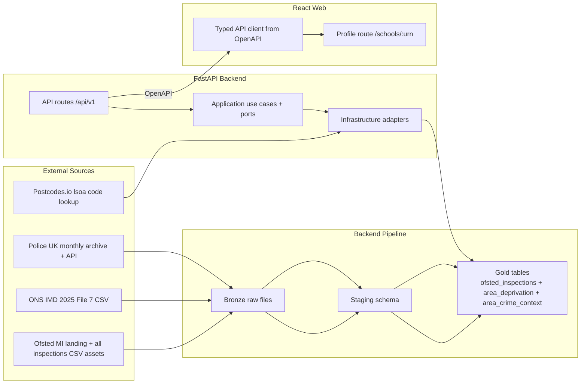

# Phase 2 Design Index - Ofsted Timeline + Area Context

## Document Control

- Status: Draft
- Last updated: 2026-03-02
- Phase owner: Product + Engineering
- Source phase: `.planning/phased-delivery.md`

## Purpose

This folder contains implementation-ready planning for Phase 2.

Phase 2 extends the Phase 1 school profile slice by adding:

1. Full Ofsted inspection timeline depth.
2. Area deprivation context from ONS Indices of Deprivation.
3. Area crime context from Police UK data.
4. Profile API and web profile enhancements to present the new depth.

## Non-Negotiable Phase Gate

All source-dependent work is blocked by `2A-source-contract-gate.md`.

No Phase 2 pipeline or API implementation may start unless the gate has passed with:

- real callable endpoints,
- verified field-level evidence,
- explicit fallback paths.

## Architecture View

## Delivery Model

Phase 2 is split into eight substantial deliverables:

1. `2A-source-contract-gate.md`
2. `2B-ofsted-timeline-pipeline.md`
3. `2C-ons-imd-pipeline.md`
4. `2D-police-crime-context-pipeline.md`
5. `2E-school-profile-api-extensions.md`
6. `2F-web-profile-area-context-enhancements.md`
7. `2G-phase-2-quality-gates.md`
8. `source-verification-2026-03-02.md`

## Execution Sequence

1. Complete `2A` first. This is a hard gate.
2. Complete `2B`, `2C`, and `2D` once source contracts are verified.
3. Complete `2E` after Phase 2 Gold tables are queryable.
4. Complete `2F` after `2E` OpenAPI contract is frozen and synced to web types.
5. Complete `2G` as final closeout and sign-off checklist.

## Source Verification Snapshot (2026-03-02)

- Ofsted landing page and CSV asset family callable:
  - landing page `200`,
  - latest `all_inspections` asset `200`,
  - latest `latest_inspections` asset `200`,
  - historical 2015-2019 timeline asset `200`.
- ONS IMD 2025 release callable:
  - landing page `200`,
  - File 7 CSV `200`,
  - required `LSOA`, `IMD decile`, and `IDACI` columns present.
- Police UK contracts callable:
  - archive index `200`,
  - monthly archive pattern available through `2026-01.zip`,
  - `crime-last-updated`, `crimes-street-dates`, and `crime-categories` endpoints `200`,
  - street-level endpoint callable with real JSON payload.
- Supporting postcode geography contract callable:
  - `GET https://api.postcodes.io/postcodes/{postcode}` `200`,
  - `result.codes.lsoa` field present.

## Progress (2026-03-02)

- 2A Source contract gate: completed.
- 2B Ofsted timeline pipeline: completed.
- 2C ONS IMD pipeline: planned.
- 2D Police crime context pipeline: planned.
- 2E School profile API extensions: planned.
- 2F Web profile area context enhancements: planned.
- 2G Phase 2 quality gates: planned.

## Tracking Log

- 2026-03-02 (implementation checkpoint):
  - Completed Phase 2A source contract gate implementation:
    - added `tools/scripts/verify_phase2_sources.py`,
    - added `apps/backend/tests/unit/test_verify_phase2_sources.py`.
  - Revalidated focused tests:
    - `uv run --project apps/backend pytest apps/backend/tests/unit/test_verify_phase2_sources.py -q`
    - `uv run --project apps/backend pytest apps/backend/tests/unit/test_verify_phase1_sources.py apps/backend/tests/unit/test_verify_phase2_sources.py -q`
  - Revalidated gate command:
    - `uv run --project apps/backend python tools/scripts/verify_phase2_sources.py`
  - Result: Phase 2A gate command passed with live endpoint checks.
- 2026-03-02 (implementation checkpoint):
  - Completed Phase 2B Ofsted timeline pipeline:
    - added `apps/backend/src/civitas/infrastructure/pipelines/ofsted_timeline.py`,
    - added migration `apps/backend/alembic/versions/20260302_06_phase2_ofsted_inspections.py`,
    - added fixtures and tests under `apps/backend/tests/{fixtures,unit,integration}/ofsted_timeline*`.
  - Updated pipeline/config wiring:
    - `PipelineSource.OFSTED_TIMELINE` registration in registry + CLI source coverage.
    - timeline source settings and `.env` / runbook entries.
  - Revalidated focused backend checks:
    - `uv run --project apps/backend ruff check apps/backend`
    - `uv run --project apps/backend pytest apps/backend/tests/unit/test_ofsted_timeline_transforms.py apps/backend/tests/integration/test_ofsted_timeline_pipeline.py apps/backend/tests/unit/test_pipeline_cli.py apps/backend/tests/unit/test_settings.py -q`
  - Result: Phase 2B implementation complete and test-covered.

## Phase 2 Definition Of Done

- Profile shows latest Ofsted headline plus inspection history timeline.
- Profile shows area context:
  - deprivation (IMD decile + IDACI child-poverty proxy),
  - crime summary for the configured local radius.
- New pipelines are idempotent and rerunnable.
- OpenAPI contract and web generated types are in sync.
- `make lint` and `make test` pass.

## Change Management

- `.planning/phased-delivery.md` remains the high-level source of truth.
- If scope, sequencing, or acceptance criteria evolve, update this folder and `.planning/phased-delivery.md` in the same change.
- If source coverage constraints change any intended metric behavior, record the decision explicitly in `2A` and affected deliverable docs.

## Decisions Captured

- 2026-03-02: Phase 2 includes a non-negotiable source contract gate before all source-dependent implementation.
- 2026-03-02: Ofsted timeline ingest will use the `all_inspections` asset family plus historical backfill assets, not the latest-only snapshot.
- 2026-03-02: IMD context source is IoD2025 File 7 CSV with IoD2019 File 7 as fallback.
- 2026-03-02: Police area crime context uses monthly archive files as primary ingest path, with API endpoints used for freshness checks and controlled fallback.
