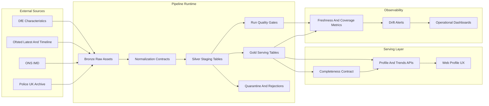

# Phase 3 Design Index - Hardening: Data Reliability, Completeness, And Pipeline Resilience

## Document Control

- Status: Implemented
- Last updated: 2026-03-06
- Phase owner: Product + Engineering
- Source phase: `.planning/phased-delivery.md`
- Legacy workstream IDs retained: `H1` through `H7`

## Purpose

This folder contains implementation-ready design for the hardening sprint that stabilized the already-shipped search and profile slices before further expansion.

Phase 3 focuses on:

1. Deterministic pipeline quality gates and run classification.
2. Source normalization contracts at the Bronze -> Silver boundary.
3. Historical demographics backfill and lookback controls.
4. Explicit completeness contracts in API and UI.
5. Observability for freshness and coverage drift.
6. Resilience and performance hardening for large ingests.

## Architecture View

## Delivery Model

Phase 3 is split into seven substantial deliverables:

1. `H1-pipeline-run-policy-quality-gates.md`
2. `H2-source-normalization-contracts.md`
3. `H3-historical-demographics-backfill-lookback.md`
4. `H4-data-completeness-contract-api-ui.md`
5. `H5-operational-observability-freshness-coverage-drift.md`
6. `H6-pipeline-resilience-performance-hardening.md`
7. `H7-hardening-quality-gates-signoff.md`

## Execution Sequence

1. Complete `H1` first to enforce deterministic run outcomes.
2. Complete `H2` to stabilize normalization and reject behavior.
3. Complete `H3` for historical demographic depth and configurable lookback.
4. Complete `H4` so completeness is explicit for API and UI consumers.
5. Complete `H5` to monitor drift and freshness continuously.
6. Complete `H6` for throughput, fault tolerance, and operational safety.
7. Complete `H7` as final closeout and sign-off.

## Definition Of Done

- Pipeline runs fail on quality breaches instead of silently succeeding.
- Source normalization behavior is versioned, test-covered, and source-specific.
- Historical demographics support configurable lookback and produce multi-year trends where source data exists.
- Profile API and web UI expose clear section-level completeness and reason codes.
- Freshness and coverage drift metrics are available and alerting is active.
- Large pipeline runs are resumable, observable, and operationally safe.
- `make lint` and `make test` pass in one consistent repository state.

## Change Management

- `.planning/phased-delivery.md` remains the high-level source of truth.
- If scope, sequence, or acceptance criteria evolve, update this folder and `.planning/phased-delivery.md` in the same change.
- If source constraints alter user-facing completeness behavior, record the decision in `H2` and `H4`.

## Decisions Captured

- 2026-03-03: hardening is treated as a dedicated phase, not ad-hoc fixes.
- 2026-03-03: Bronze remains immutable; normalization contracts are enforced at the Silver boundary.
- 2026-03-03: completeness transparency is a product requirement, not only an operational concern.
- 2026-03-04: hardening phase signed off with full gate evidence in `signoff-2026-03-04.md`.
