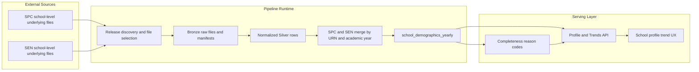

# Phase 4 Design Index - Source Strategy Stabilization + Trend History Recovery

## Document Control

- Status: Implemented
- Last updated: 2026-03-06
- Phase owner: Product + Engineering
- Source phase: `.planning/phased-delivery.md`
- Legacy workstream IDs retained: `S1` through `S6`

## Purpose

This folder contains implementation-ready planning for the stabilization sprint that resolved source-strategy issues affecting trend reliability and completeness messaging.

Phase 4 addresses two concrete problems:

1. Historical trends were sparse because demographics ingestion was effectively single-year.
2. Completeness messaging risked exposing implementation phrasing instead of source-aware, parent-facing explanations.

## Engineering Guardrails

1. Do not add backwards-compatibility shims for the old single-dataset path.
2. Do not dual-run old and new demographics ingestion logic beyond short validation windows explicitly documented in sign-off.
3. Do not add adapter indirection unless required by a concrete source contract difference covered in tests.
4. Prefer replacement and deletion over parallel codepaths.

## Why This Phase Exists

As of 2026-03-04, the previously configured DfE dataset path only provided one academic year for the active school-level characteristics feed. That was not sufficient for robust year-over-year trend behavior.

Phase 4 introduced a multi-source strategy based on verified school-level release files and formalized the quality gates required before expansion work resumed.

## Architecture View

## Delivery Model

Phase 4 is split into six deliverables:

1. `S1-source-contract-and-catalog-freeze.md`
2. `S2-release-file-discovery-and-bronze-ingest.md`
3. `S3-multi-source-normalization-and-gold-upsert.md`
4. `S4-completeness-contract-and-parent-facing-copy.md`
5. `S5-quality-gates-and-signoff.md`
6. `S6-school-level-ethnicity-breakdown-support.md`

## Execution Sequence

1. Complete `S1` first to freeze approved source families and schema requirements.
2. Complete `S2` to make source discovery and Bronze ingest deterministic.
3. Complete `S3` to normalize, merge, and promote multi-year demographics.
4. Complete `S4` to align API and UI completeness semantics and user messaging.
5. Complete `S5` as hard gate sign-off.
6. Complete `S6` to close school-level ethnicity coverage using existing SPC source files.

## Definition Of Done

- Multi-year demographics history is sourced from approved, tested files.
- Open-school trend depth reaches target thresholds for primary and secondary.
- Completeness reason codes are source-aware and parent-readable.
- School-level ethnicity breakdown is supported from approved SPC school-level files.
- All implemented gates pass in one repository state, including `make lint` and `make test`.

## Change Management

- `.planning/phased-delivery.md` remains the high-level source of truth.
- Any source or catalog decision change must update `S1` and `S2` in the same PR.
- Any API or UI completeness behavior change must update `S4` in the same PR.
- Any school-level ethnicity coverage behavior change must update `S6` in the same PR.

## Decisions Captured

- 2026-03-04: progression to expansion phases was blocked until this phase was signed off.
- 2026-03-04: multi-year demographics recovery required source-strategy change, not UI-only mitigations.
- 2026-03-04: phase implementation completed with gate evidence captured in `signoff-2026-03-04.md`.
- 2026-03-04: direct FSM percentage support is enabled from SPC release files; unsupported flags now reflect source-family availability rather than a hardcoded false.
- 2026-03-04: `S6` completed to expose school-level ethnicity breakdown where SPC source data is available.
