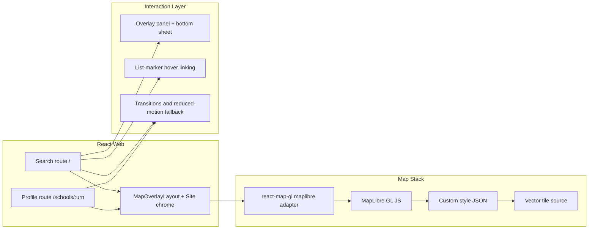

# Phase 5 Design Index - Research UX Uplift

## Document Control

- Status: Partially implemented (`UX-1` through `UX-7` complete; `UX-8` planned)
- Last updated: 2026-03-06
- Phase owner: Product + Engineering
- Source phase: `.planning/phased-delivery.md`
- Legacy workstream IDs retained: `UX-1` through `UX-8`
- Reference standard: [The Refugee Project](https://www.therefugeeproject.org/)

## Purpose

This folder contains implementation-ready planning for the Civitas research UX uplift phase.

Phase 5 upgrades the existing search and profile experience by delivering:

1. A UK-bounded vector-rendered map canvas with strong cartographic control.
2. Deeper map/list interaction patterns and motion continuity.
3. Refined overlay layout, typography, and visual hierarchy.
4. Navigation chrome and loading-state polish that supports a map-first product experience.
5. A user-selectable dark and light theme mode that keeps map and UI surfaces visually coherent.

## Architecture View

## Gap Snapshot

Current baseline strengths:

- Search and profile routes are functional and tested.
- Shared primitives and design tokens are in place.
- Build budgets and accessibility rails already exist.

Primary gaps this phase addresses:

- deeper cartographic control
- richer map/list interaction behavior
- stronger overlay ergonomics and mobile map visibility
- better motion continuity
- contextual loading, empty, and error feedback tied to map state
- explicit theme selection with map parity

## Delivery Model

Phase 5 is split into eight substantial deliverables:

1. `UX-1-maplibre-migration-uk-bounds-landing-state.md`
2. `UX-2-map-interaction-depth.md`
3. `UX-3-overlay-panel-refinement.md`
4. `UX-4-typography-spacing-visual-hierarchy.md`
5. `UX-5-transitions-motion.md`
6. `UX-6-navigation-site-chrome-refinement.md`
7. `UX-7-loading-empty-state-polish.md`
8. `UX-8-theme-mode-toggle.md`

## Execution Sequence

1. Complete `UX-1` first. It is the map foundation gate for all map-first interactions.
2. Complete `UX-2`, `UX-3`, `UX-4`, and `UX-6` after `UX-1`.
3. Complete `UX-5` after `UX-2` and `UX-3` stabilize interaction and layout behavior.
4. Complete `UX-7` after `UX-2` so map-loading states can reuse finalized interaction primitives.
5. Complete `UX-8` after `UX-4` and `UX-6` so semantic tokens and site chrome behavior are stable before adding cross-app theme switching.

## Relationship To Other Phases

- Phase 5 can run alongside backend expansion work, but frontend styling should stay aligned with Phase 2 profile sections.
- Final trend-state UX should align with the completeness semantics established in Phase 4.
- If theme preference is ever account-backed instead of local-only, that work belongs in Phase 10.

## Progress (2026-03-06)

- `UX-1` through `UX-7`: complete and verified.
- `UX-8`: still planned.

## Definition Of Done

- Search uses UK-bounded MapLibre vector rendering with Civitas-aligned styling.
- Map and results panel are interaction-linked.
- Overlay panel supports polished desktop and mobile interaction patterns.
- Typography and spacing create a clear data-first hierarchy.
- Motion respects `prefers-reduced-motion`.
- Loading, empty, and error states preserve map context.
- Users can toggle between dark and light mode with persisted preference and accessible contrast in both themes.
- Performance, accessibility, and repository quality gates pass.

## Change Management

- `.planning/phased-delivery.md` remains the high-level source of truth.
- If scope, sequencing, or acceptance criteria evolve, update this folder and `.planning/phased-delivery.md` in the same change.
- If map provider constraints or style-hosting decisions change, record them explicitly in `UX-1` and affected downstream docs.
