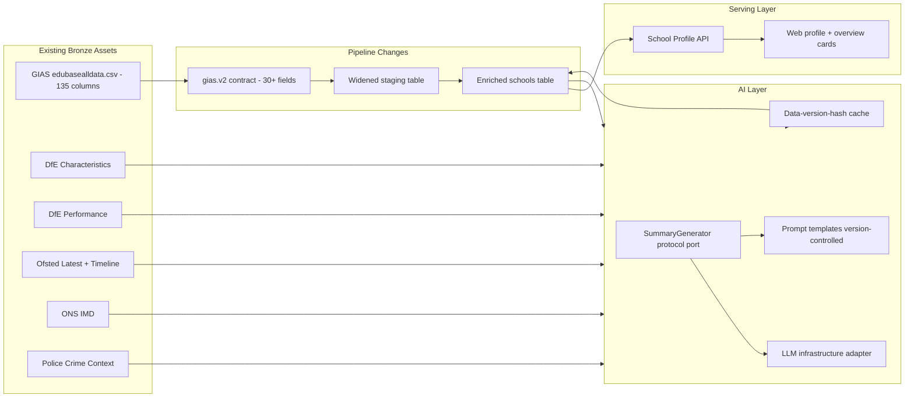

# Phase AI Design Index - School Enrichment And AI-Generated Summaries

## Document Control

- Status: Proposed
- Last updated: 2026-03-05
- Phase owner: Product + Engineering
- Source phase: `.planning/phased-delivery.md`
- Reference: `.planning/ai-features.md`

## Purpose

This folder contains implementation-ready planning for enriching school profile data and introducing AI-generated school summaries.

The phase targets:

1. Widening the GIAS pipeline to extract ~20 additional fields already present in Bronze CSV (website, phone, head teacher, address, age range, religious character, admissions policy, trust/MAT, etc.).
2. AI-generated factual school overviews using a port-based LLM integration that follows existing hexagonal architecture.
3. AI-generated premium analysis ("Grok's Take") with deeper metric-by-metric commentary.
4. An extensible AI platform foundation for future features (comparison narratives, natural-language search, trend interpretation).

## Key Finding

The GIAS Bronze CSV (`edubasealldata.csv`) contains **135 columns**. The current pipeline (`gias.v1`) extracts only 12. No government bulk dataset provides free-text school descriptions, making AI generation the natural path for descriptive content.

## Architecture View

## Engineering Guardrails

1. Follow existing hexagonal architecture: domain port protocol -> application use case -> infrastructure adapter.
2. LLM integration must be port-based and swappable (no direct vendor SDK calls in application/domain layers).
3. AI-generated text is pre-generated and stored, never live-generated on user request.
4. Prompt templates are version-controlled alongside code, not embedded in infrastructure.
5. All AI text carries a data-version hash so stale summaries are detectable and re-generable.
6. GIAS contract bump is a breaking change: `gias.v1` -> `gias.v2`. Staging table and promote SQL must be updated atomically.
7. No AI-generated content may include rankings, subjective advice, recommendations, or suitability guidance.
8. AI outputs must be grounded in assembled Civitas data context only (no open-web lookup or model-memory claims in this phase).
9. Premium content exposure must be enforced by backend entitlement checks, never client-provided tier flags.

## Delivery Model

Phase AI is split into four deliverables:

1. `AI-1-gias-enrichment.md` - Widen GIAS pipeline to extract additional school fields.
2. `AI-2-school-overview-summary.md` - AI-generated factual school overview (free tier).
3. `AI-3-groks-take-premium-analysis.md` - AI-generated premium analysis with metric commentary.
4. `AI-4-extensible-ai-platform.md` - Generalise AI infrastructure for future features.

## Execution Sequence

1. Complete `AI-1` first - enriched school data is a prerequisite for meaningful AI summaries.
2. Complete `AI-2` - factual overview requires enriched profile data from all Gold sources.
3. Complete `AI-3` - premium analysis builds on the same AI infrastructure with deeper prompts.
4. Complete `AI-4` - generalisation only after concrete features prove the pattern.

## Dependencies

- All existing pipelines must be healthy (GIAS, DfE, Ofsted, ONS IMD, Police Crime).
- Phase Hardening quality gates must be in place before AI-generated content enters Gold.
- Phase Source Stabilization multi-year demographics should be complete for richer summaries.
- AI summary generation runs only after successful Bronze -> Silver -> Gold completion.
