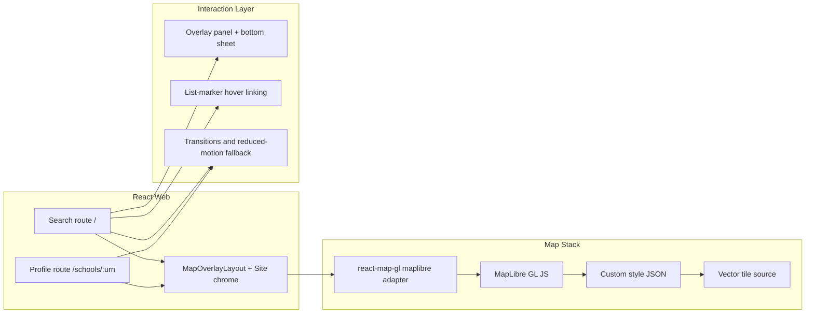

# Phase UX Design Index - Visual Quality And Interaction Uplift

## Document Control

- Status: Draft
- Last updated: 2026-03-02
- Phase owner: Product + Engineering
- Source phase: `.planning/phased-delivery.md`
- Reference standard: [The Refugee Project](https://www.therefugeeproject.org/)

## Purpose

This folder contains implementation-ready planning for the Civitas visual quality uplift phase.

Phase UX upgrades the existing search/profile web experience by delivering:

1. A UK-bounded vector-rendered map canvas with strong cartographic control.
2. Deeper map/list interaction patterns and motion continuity.
3. Refined overlay layout, typography, and visual hierarchy.
4. Navigation chrome and loading-state polish that supports a map-first product experience.

## Architecture View

## Gap Snapshot

Current baseline strengths:

- Tokenized dark visual system and shared primitives are in place.
- Search and profile routes are functional and tested.
- Build budgets and Lighthouse checks already exist.

Primary gaps this phase addresses:

- Raster map constraints (limited cartographic control and generic map feel).
- Shallow list/map interaction behavior.
- Overlay panel ergonomics and mobile map visibility.
- Motion and transition continuity between major views.
- Contextual loading/empty/error feedback tied to map state.

## Delivery Model

Phase UX is split into seven substantial deliverables:

1. `UX-1-maplibre-migration-uk-bounds-landing-state.md`
2. `UX-2-map-interaction-depth.md`
3. `UX-3-overlay-panel-refinement.md`
4. `UX-4-typography-spacing-visual-hierarchy.md`
5. `UX-5-transitions-motion.md`
6. `UX-6-navigation-site-chrome-refinement.md`
7. `UX-7-loading-empty-state-polish.md`

## Execution Sequence

1. Complete `UX-1` first. It is the map foundation gate for all map-first interactions.
2. Complete `UX-2`, `UX-3`, `UX-4`, and `UX-6` after `UX-1`.
3. Complete `UX-5` after `UX-2` and `UX-3` stabilize interaction and layout behavior.
4. Complete `UX-7` after `UX-2` so map-loading states can reuse finalized interaction primitives.

## Relationship To Phase 2

Phase UX is orthogonal to Phase 2 backend data work and can run in parallel.

Coordination point:

- As Phase 2 profile enhancements land (`2F`), apply `UX-4` typography and spacing standards immediately to prevent style drift.

## Progress (2026-03-02)

- UX-1 MapLibre migration, UK bounds, landing state: planned.
- UX-2 Map interaction depth: planned.
- UX-3 Overlay panel refinement: planned.
- UX-4 Typography, spacing, and visual hierarchy: planned.
- UX-5 Transitions and motion: planned.
- UX-6 Navigation and site chrome refinement: planned.
- UX-7 Loading and empty state polish: planned.

## Phase UX Definition Of Done

- Search route uses UK-bounded MapLibre vector rendering with Civitas-aligned dark style.
- Map and results panel are interaction-linked (hover, focus, fly-to, clustering, radius context).
- Overlay panel supports polished desktop and mobile interaction patterns.
- Typography and spacing produce an editorial data-storytelling hierarchy on search and profile routes.
- Motion is purposeful and fully respects `prefers-reduced-motion`.
- Header/footer chrome behavior matches map-first focus requirements.
- Loading, empty, and error states retain map context and provide actionable feedback.
- Performance, accessibility, and repository quality gates pass.

## Change Management

- `.planning/phased-delivery.md` remains the high-level source of truth.
- If scope, sequencing, or acceptance criteria evolve, update this folder and `.planning/phased-delivery.md` in the same change.
- If map provider constraints or style-hosting decisions change, record them explicitly in `UX-1` and any affected downstream docs.

## Decisions Captured

- 2026-03-02: Phase UX map engine changes from Leaflet raster stack to MapLibre vector rendering.
- 2026-03-02: UX-1 is the mandatory first step; all major map-interaction deliverables depend on it.
- 2026-03-02: Accessibility and performance rails from earlier phases remain mandatory and non-negotiable.
- 2026-03-02: Vector tile source for UX-1 is Protomaps free CDN with MapTiler as explicit fallback. Self-hosting deferred post-v1.
- 2026-03-02: Style authoring starts from Protomaps dark basemap skeleton, stripped and recoloured to Civitas navy palette. Style committed as `civitas-dark.json`.
- 2026-03-02: Map labels target Space Grotesk glyph range; Noto Sans geometric fallback if glyph hosting is not feasible in v1.
- 2026-03-02: Map design intent documented in UX-1 — school markers are the only saturated element; all map features live inside the navy palette.

## Open Decisions

1. Space Grotesk glyph hosting: self-hosted glyph PBF range versus Noto Sans CDN fallback.
2. Mobile bottom-sheet implementation: hand-rolled versus dedicated dependency (UX-3).
3. Visual regression tooling: Playwright snapshots versus external tooling.