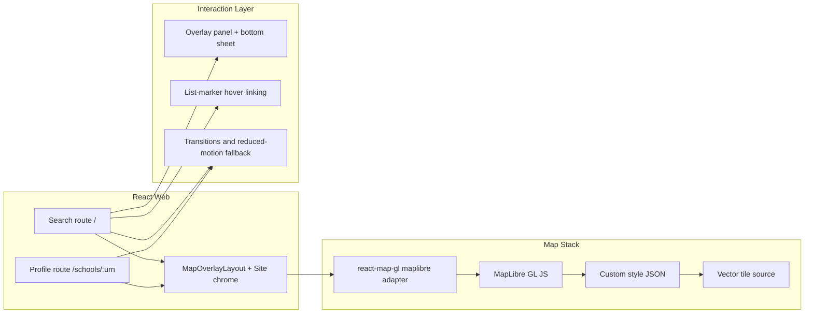

# Phase UX Design Index - Visual Quality And Interaction Uplift

## Document Control

- Status: Extended (UX-8 proposed)
- Last updated: 2026-03-03
- Phase owner: Product + Engineering
- Source phase: `.planning/phased-delivery.md`
- Reference standard: [The Refugee Project](https://www.therefugeeproject.org/)

## Purpose

This folder contains implementation-ready planning for the Civitas visual quality uplift phase.

Phase UX upgrades the existing search/profile web experience by delivering:

1. A UK-bounded vector-rendered map canvas with strong cartographic control.
2. Deeper map/list interaction patterns and motion continuity.
3. Refined overlay layout, typography, and visual hierarchy.
4. Navigation chrome and loading-state polish that supports a map-first product experience.
5. A user-selectable dark/light theme mode that keeps map and UI surfaces visually coherent.

## Architecture View

## Gap Snapshot

Current baseline strengths:

- Tokenized dark visual system and shared primitives are in place.
- Search and profile routes are functional and tested.
- Build budgets and Lighthouse checks already exist.

Primary gaps this phase addresses:

- Raster map constraints (limited cartographic control and generic map feel).
- Shallow list/map interaction behavior.
- Overlay panel ergonomics and mobile map visibility.
- Motion and transition continuity between major views.
- Contextual loading/empty/error feedback tied to map state.
- Single-theme limitation (no explicit user control to switch between dark and light modes).

## Delivery Model

Phase UX is split into eight substantial deliverables:

1. `UX-1-maplibre-migration-uk-bounds-landing-state.md`
2. `UX-2-map-interaction-depth.md`
3. `UX-3-overlay-panel-refinement.md`
4. `UX-4-typography-spacing-visual-hierarchy.md`
5. `UX-5-transitions-motion.md`
6. `UX-6-navigation-site-chrome-refinement.md`
7. `UX-7-loading-empty-state-polish.md`
8. `UX-8-theme-mode-toggle.md`

## Execution Sequence

1. Complete `UX-1` first. It is the map foundation gate for all map-first interactions.
2. Complete `UX-2`, `UX-3`, `UX-4`, and `UX-6` after `UX-1`.
3. Complete `UX-5` after `UX-2` and `UX-3` stabilize interaction and layout behavior.
4. Complete `UX-7` after `UX-2` so map-loading states can reuse finalized interaction primitives.
5. Complete `UX-8` after `UX-4` and `UX-6` so semantic tokens and site chrome behavior are stable before adding cross-app theme switching.

## Relationship To Phase 2

Phase UX is orthogonal to Phase 2 backend data work and can run in parallel.

Coordination point:

- As Phase 2 profile enhancements land (`2F`), apply `UX-4` typography and spacing standards immediately to prevent style drift.

## Progress (2026-03-03)

- UX-1 MapLibre migration, UK bounds, landing state: **complete.**
  - MapLibre GL JS + react-map-gl/maplibre rendering with Protomaps vector tiles.
  - Custom `civitas-dark.json` style committed with full navy palette.
  - UK bounds, min/max zoom, default landing view enforced.
  - Leaflet stack fully removed (deps, CSS, dead `map-tiles` modules).
- UX-2 Map interaction depth: **complete.**
  - Fly-to animation on search (with reduced-motion `jumpTo` fallback).
  - Radius overlay via `@turf/circle` GeoJSON fill + dashed line.
  - Bi-directional list-marker hover/focus linking (`activeSchoolId` wired through feature orchestrator to both `SchoolsMap` and `SchoolsList`/`ResultCard`).
  - Marker clustering via MapLibre native GeoJSON clustering.
  - Data-driven marker colouring via phase (Ofsted rating ready when backend adds field to search response).
  - Compact popup card with school name, phase, distance, Ofsted rating.
- UX-3 Overlay panel refinement: **complete.**
  - Hidden scrollbars with scroll-shadow affordance.
  - Desktop collapse/expand with persistent session state.
  - Mobile bottom-sheet with peek/expanded/drag interaction.
  - Result context summary in collapsed rail and inline.
- UX-4 Typography, spacing, and visual hierarchy: **complete.**
  - Token-driven typography scale, editorial heading hierarchy.
  - ResultCard visual hierarchy refinement.
  - StatCard large-value treatment.
- UX-5 Transitions and motion: **complete.**
  - `useReducedMotion` hook with reactive `matchMedia` listener.
  - Route transition wrapper (`RouteTransition` cross-fade on pathname change).
  - Panel content reveal and results-reveal animations.
  - Marker entrance animation (`marker-enter` scale+opacity keyframe).
  - Full `prefers-reduced-motion` blanket disable.
- UX-6 Navigation and site chrome refinement: **complete.**
  - Transparent header on search map route, solid on profile/static.
  - Footer suppressed on search route.
  - Breadcrumbs with postcode context on profile route.
  - Active search context chip in header.
- UX-7 Loading and empty state polish: **complete.**
  - Shaped `result-card` skeleton variant matching card geometry.
  - `MapEmptyState` component with context-aware messaging (postcode + radius).
  - Error state with non-destructive retry and last-known context preservation.
  - Map loading pulse indicator.
- UX-8 Theme mode toggle (dark/light): **proposed.**
  - Add semantic dual-theme token model with explicit user preference and system fallback.
  - Add header-level toggle and persistent preference storage.
  - Add map style parity for dark/light mode (`civitas-dark.json` + `civitas-light.json`).

## Phase UX Definition Of Done

- Search route uses UK-bounded MapLibre vector rendering with Civitas-aligned dark style.
- Map and results panel are interaction-linked (hover, focus, fly-to, clustering, radius context).
- Overlay panel supports polished desktop and mobile interaction patterns.
- Typography and spacing produce an editorial data-storytelling hierarchy on search and profile routes.
- Motion is purposeful and fully respects `prefers-reduced-motion`.
- Header/footer chrome behavior matches map-first focus requirements.
- Loading, empty, and error states retain map context and provide actionable feedback.
- Users can toggle between dark and light mode with persisted preference and accessible contrast in both themes.
- Performance, accessibility, and repository quality gates pass.

## Change Management

- `.planning/phased-delivery.md` remains the high-level source of truth.
- If scope, sequencing, or acceptance criteria evolve, update this folder and `.planning/phased-delivery.md` in the same change.
- If map provider constraints or style-hosting decisions change, record them explicitly in `UX-1` and any affected downstream docs.

## Decisions Captured

- 2026-03-02: Phase UX map engine changes from Leaflet raster stack to MapLibre vector rendering.
- 2026-03-02: UX-1 is the mandatory first step; all major map-interaction deliverables depend on it.
- 2026-03-02: Accessibility and performance rails from earlier phases remain mandatory and non-negotiable.
- 2026-03-02: Vector tile source for UX-1 is Protomaps free CDN with MapTiler as explicit fallback. Self-hosting deferred post-v1.
- 2026-03-02: Style authoring starts from Protomaps dark basemap skeleton, stripped and recoloured to Civitas navy palette. Style committed as `civitas-dark.json`.
- 2026-03-02: Map labels target Space Grotesk glyph range; Noto Sans geometric fallback if glyph hosting is not feasible in v1.
- 2026-03-02: Map design intent documented in UX-1 - school markers are the only saturated element; all map features live inside the navy palette.
- 2026-03-03: All seven UX deliverables implemented and verified (lint, typecheck, 278 tests, build, budget).
- 2026-03-03: Leaflet stack fully removed - deps, CSS selectors, and dead `map-tiles.ts` modules deleted.
- 2026-03-03: Mobile bottom-sheet implemented hand-rolled (no third-party dependency).
- 2026-03-03: Noto Sans used as map label font - Space Grotesk glyph hosting deferred to post-v1.
- 2026-03-03: Ofsted rating marker colouring is architecturally wired but requires backend to add `ofsted_rating` field to `SchoolSearchItemResponse`; phase-based colouring active as designed fallback.
- 2026-03-03: Phase UX is extended with `UX-8` to add a user-selectable dark/light mode and map style parity.

## Open Decisions

1. Space Grotesk glyph hosting: deferred post-v1. Using Noto Sans CDN fallback.
2. Visual regression tooling: not yet selected. Playwright snapshots recommended as first step.
3. Backend expansion: add `ofsted_rating` to search API response to enable full data-driven marker colouring.
4. Theme preference persistence scope: local browser storage only for now, or sync to authenticated user profile in Phase 4.
