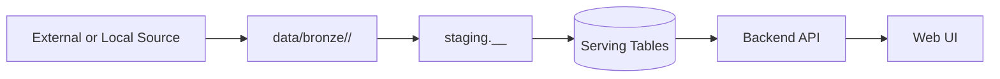
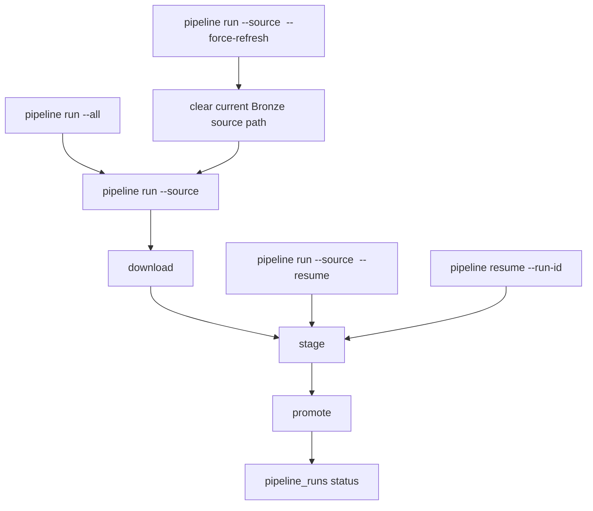

# Data Pipeline Runbook

This page explains how Civitas pipeline runs work, where data lands, and how to run and validate ingests safely.

## Core Rule: Bronze -> Silver -> Gold

Every pipeline run must flow through all three zones:

1. Bronze: raw downloaded/copied source assets.
2. Silver: normalized staging tables (`staging` schema, run-scoped tables).
3. Gold: serving tables used by API/UI.

Do not bypass zones by writing directly to Gold.



## Canonical Bronze Root

The canonical Bronze root is:

- `data/bronze`

Default runtime setting:

- `CIVITAS_BRONZE_ROOT=data/bronze`

Non-canonical Bronze roots are rejected by default. An alternate root is only allowed when
`CIVITAS_ALLOW_NONCANONICAL_BRONZE_ROOT=true` is set for an explicitly approved drill.

## Zone Responsibilities

## Bronze

- Stores raw source payloads plus metadata/manifests.
- Layout: `data/bronze/<source>/<run-date>/...`
- Files are source-specific (CSV/ZIP/manifests/metadata JSON).
- Used for traceability and no-change detection checksums.
- `police_crime_context/archive.metadata.json` also records extracted coverage diagnostics:
  - `archive_months`, `archive_month_count`
  - `archive_forces`, `archive_force_count`

## Silver

- Uses temporary run-scoped staging tables in `staging` schema.
- Tables are recreated per run and dropped after promote.
- Applies contract normalization and collects rejection diagnostics in `pipeline_rejections`.

## Gold

- Stores serving records for profile and trends APIs.
- Promote step uses upserts (`ON CONFLICT ... DO UPDATE`) on natural keys.
- Reruns update existing records instead of creating key-level duplicates.

## Gold Keys (No Duplicate Guarantees)

Upserts are keyed by:

- `schools`: `(urn)`
- `school_demographics_yearly`: `(urn, academic_year)`
- `school_ethnicity_yearly`: `(urn, academic_year)`
- `school_performance_yearly`: `(urn, academic_year)`
- `school_ofsted_latest`: `(urn)`
- `ofsted_inspections`: `(inspection_number)`
- `area_deprivation`: `(lsoa_code)`
- `area_crime_context`: `(urn, month, crime_category, radius_meters)`

Derived operational metadata:
- `area_crime_global_metadata`: singleton row (`id=1`) refreshed by the Police crime promote step for fast profile reads.
- `app_cache_versions`: cache invalidation tokens bumped after successful pipeline runs (for API cache coherence).

## Run Modes



Common commands:

- `uv run --project apps/backend civitas pipeline run --source gias`
- `uv run --project apps/backend civitas pipeline run --source gias --force-refresh`
- `uv run --project apps/backend civitas pipeline run --source dfe_performance`
- `uv run --project apps/backend civitas pipeline run --all`
- `uv run --project apps/backend civitas pipeline run --source gias --resume`
- `uv run --project apps/backend civitas pipeline resume --run-id <pipeline-run-id>`
- `uv run --project apps/backend civitas pipeline materialize-benchmarks --all`
- `uv run --project apps/backend civitas pipeline materialize-benchmarks --urn 105448 --urn 106015`
- `uv run --project apps/backend civitas generate-summaries`
- `uv run --project apps/backend civitas poll-summary-batches`
- `uv run --project apps/backend python tools/scripts/verify_phase_s_sources.py`
- `uv run --project apps/backend python tools/scripts/check_demographics_trend_coverage.py --strict`

## Full Local Hydration Sequence

From repo root:

```bash
uv run --project apps/backend civitas pipeline run --source gias
uv run --project apps/backend civitas pipeline run --source dfe_characteristics
uv run --project apps/backend civitas pipeline run --source dfe_attendance
uv run --project apps/backend civitas pipeline run --source dfe_behaviour
uv run --project apps/backend civitas pipeline run --source dfe_workforce
uv run --project apps/backend civitas pipeline run --source dfe_performance
uv run --project apps/backend civitas pipeline run --source ons_imd
uv run --project apps/backend civitas pipeline run --source uk_house_prices
uv run --project apps/backend civitas pipeline run --source police_crime_context
uv run --project apps/backend civitas pipeline run --source ofsted_latest
uv run --project apps/backend civitas pipeline run --source ofsted_timeline
uv run --project apps/backend civitas pipeline run --source school_financial_benchmarks
```

## Quality And Health Checks

- `uv run --project apps/backend python tools/scripts/check_data_quality_slo.py --strict`
- `uv run --project apps/backend python tools/scripts/run_pipeline_recovery_drill.py --strict`
- `uv run --project apps/backend python tools/scripts/benchmark_pipeline_throughput.py --strict`
- `make lint`
- `make test`

## Operational Notes

- `skipped_no_change` means Bronze checksums matched the last successful run for that source.
- `--force-refresh` clears the current source/day Bronze directory before download and bypasses the
  no-change short-circuit for that run.
- School profile, trends, and compare requests now treat `metric_benchmarks_yearly` as a read-only
  cache. Requests do not rebuild benchmark snapshots inline on a cache miss.
- `failed_quality_gate` means a hard gate failed (`downloaded_rows`, `staged_rows`, `promoted_rows`, or reject-ratio threshold).
- `dfe_characteristics` now runs the Phase 4 release-files pipeline (SPC + SEN discovery); there is no separate backfill command.
- `dfe_characteristics` promote writes summary demographics to `school_demographics_yearly` and ethnicity group rows to `school_ethnicity_yearly`.
- `dfe_attendance` promotes yearly school attendance and persistent-absence metrics into `school_attendance_yearly`.
- `dfe_behaviour` promotes yearly school suspensions and exclusions metrics into `school_behaviour_yearly`.
- `dfe_workforce` promotes yearly workforce summary rows into `school_workforce_yearly`, teacher characteristic breakdowns into `school_teacher_characteristics_yearly`, support-staff breakdowns into `school_support_staff_yearly`, and latest leadership attributes into `school_leadership_snapshot`.
- `dfe_workforce` preserves source-limited workforce completeness explicitly: fields that are not published for a given school/year remain null with source-status metadata rather than being backfilled with inferred zeroes.
- `dfe_workforce` full refreshes now prefilter off-window academic years before Silver load, use Postgres COPY-backed staging when available, and persist aggregated rejection counts with bounded samples instead of one row per rejected record.
- `school_financial_benchmarks` promotes academy finance rows into `school_financials_yearly`.
- `dfe_performance` ingests KS2 + KS4 School Performance Tables payloads and promotes merged yearly rows to `school_performance_yearly`.
- `uk_house_prices` promotes monthly LAD context rows into `area_house_price_context`.
- Successful runs of `gias`, `dfe_characteristics`, `dfe_attendance`, `dfe_behaviour`,
  `dfe_workforce`, `school_financial_benchmarks`, `dfe_performance`, `ons_imd`,
  `uk_house_prices`, and `police_crime_context` rebuild `metric_benchmarks_yearly`
  after promote.
- Use `civitas pipeline materialize-benchmarks --all` after restoring a database snapshot or when
  benchmark cache rows need a manual full rebuild. Successful manual materialisation now bumps the
  `school_profile` cache version token so cached profile responses refresh without waiting for the
  full in-process TTL. Use `--urn` to reseed specific schools only.
- When `CIVITAS_AI_ENABLED=true`, `pipeline run --all` submits overview-generation batches after successful promote and exits without waiting for provider completion.
- Final AI persistence happens through a separate `poll-summary-batches` pass; this should be run by an operator or external scheduler until all pending batch items are finalized.
- Keep `pipeline_runs` and `pipeline_source_locks` clean (`running=0`, no orphan locks) before sign-off.
