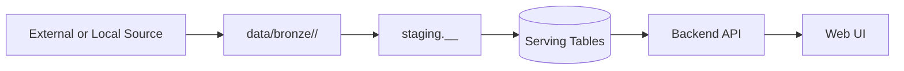
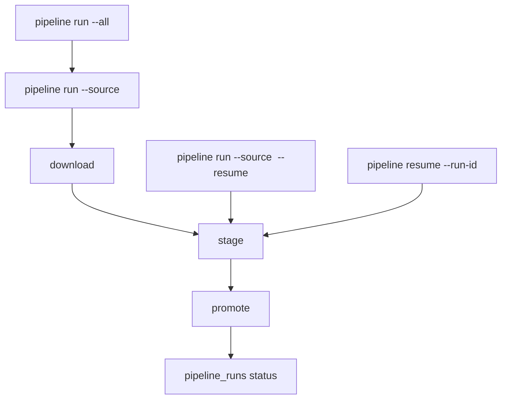

# Data Pipeline Runbook

This page explains how Civitas pipeline runs work, where data lands, and how to run and validate ingests safely.

## Core Rule: Bronze -> Silver -> Gold

Every pipeline run must flow through all three zones:

1. Bronze: raw downloaded/copied source assets.
2. Silver: normalized staging tables (`staging` schema, run-scoped tables).
3. Gold: serving tables used by API/UI.

Do not bypass zones by writing directly to Gold.



## Canonical Bronze Root

The canonical Bronze root is:

- `data/bronze`

Default runtime setting:

- `CIVITAS_BRONZE_ROOT=data/bronze`

Use alternate Bronze roots only for isolated experiments or drills, not for normal operation.

## Zone Responsibilities

## Bronze

- Stores raw source payloads plus metadata/manifests.
- Layout: `data/bronze/<source>/<run-date>/...`
- Files are source-specific (CSV/ZIP/manifests/metadata JSON).
- Used for traceability and no-change detection checksums.
- `police_crime_context/archive.metadata.json` also records extracted coverage diagnostics:
  - `archive_months`, `archive_month_count`
  - `archive_forces`, `archive_force_count`

## Silver

- Uses temporary run-scoped staging tables in `staging` schema.
- Tables are recreated per run and dropped after promote.
- Applies contract normalization and collects rejected records in `pipeline_rejections`.

## Gold

- Stores serving records for profile and trends APIs.
- Promote step uses upserts (`ON CONFLICT ... DO UPDATE`) on natural keys.
- Reruns update existing records instead of creating key-level duplicates.

## Gold Keys (No Duplicate Guarantees)

Upserts are keyed by:

- `schools`: `(urn)`
- `school_demographics_yearly`: `(urn, academic_year)`
- `school_ofsted_latest`: `(urn)`
- `ofsted_inspections`: `(inspection_number)`
- `area_deprivation`: `(lsoa_code)`
- `area_crime_context`: `(urn, month, crime_category, radius_meters)`

## Run Modes



Common commands:

- `uv run --project apps/backend civitas pipeline run --source gias`
- `uv run --project apps/backend civitas pipeline run --all`
- `uv run --project apps/backend civitas pipeline run --source gias --resume`
- `uv run --project apps/backend civitas pipeline resume --run-id <pipeline-run-id>`
- `uv run --project apps/backend civitas pipeline backfill --source dfe_characteristics --lookback-years 5`

## Full Local Hydration Sequence

From repo root:

```bash
uv run --project apps/backend civitas pipeline run --source gias
uv run --project apps/backend civitas pipeline run --source dfe_characteristics
uv run --project apps/backend civitas pipeline backfill --source dfe_characteristics --lookback-years 5
uv run --project apps/backend civitas pipeline run --source ons_imd
uv run --project apps/backend civitas pipeline run --source police_crime_context
uv run --project apps/backend civitas pipeline run --source ofsted_latest
uv run --project apps/backend civitas pipeline run --source ofsted_timeline
```

## Quality And Health Checks

- `uv run --project apps/backend python tools/scripts/check_data_quality_slo.py --strict`
- `uv run --project apps/backend python tools/scripts/run_pipeline_recovery_drill.py --strict`
- `uv run --project apps/backend python tools/scripts/benchmark_pipeline_throughput.py --strict`
- `make lint`
- `make test`

## Operational Notes

- `skipped_no_change` means Bronze checksums matched the last successful run for that source.
- `failed_quality_gate` means a hard gate failed (`downloaded_rows`, `staged_rows`, `promoted_rows`, or reject-ratio threshold).
- Keep `pipeline_runs` and `pipeline_source_locks` clean (`running=0`, no orphan locks) before sign-off.
